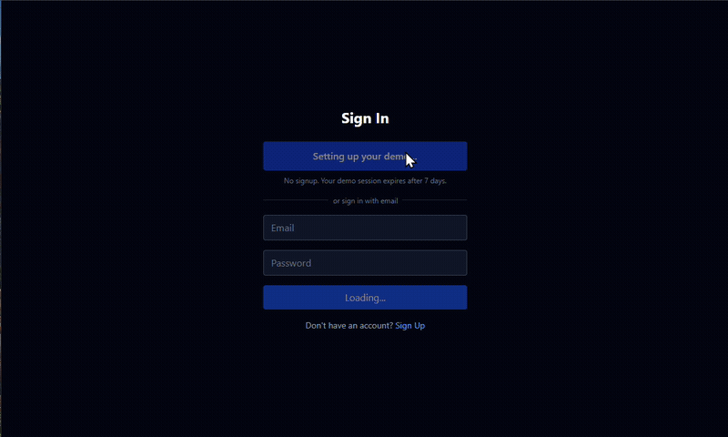
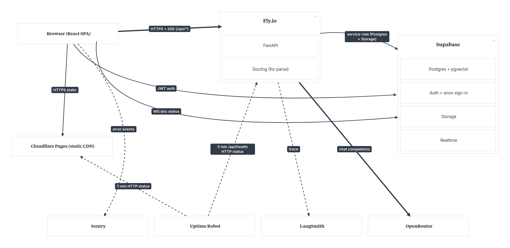
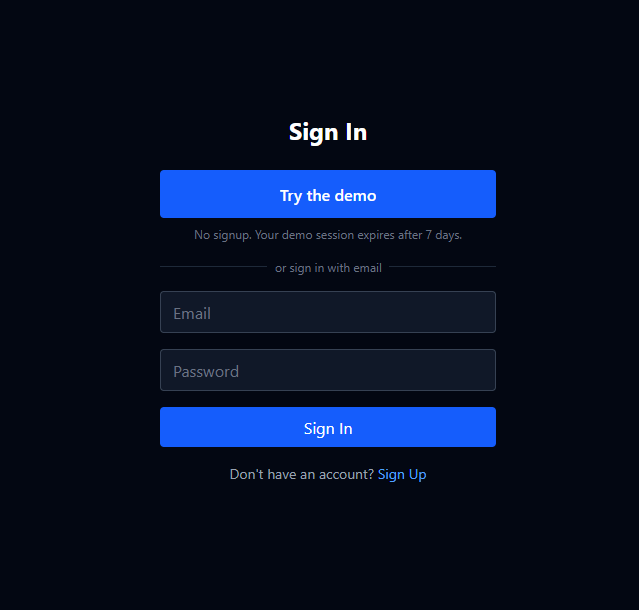
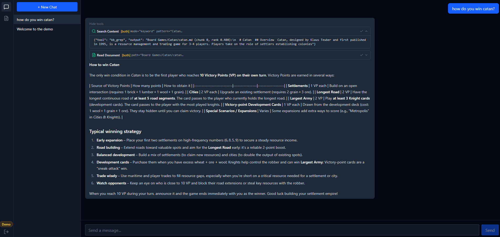
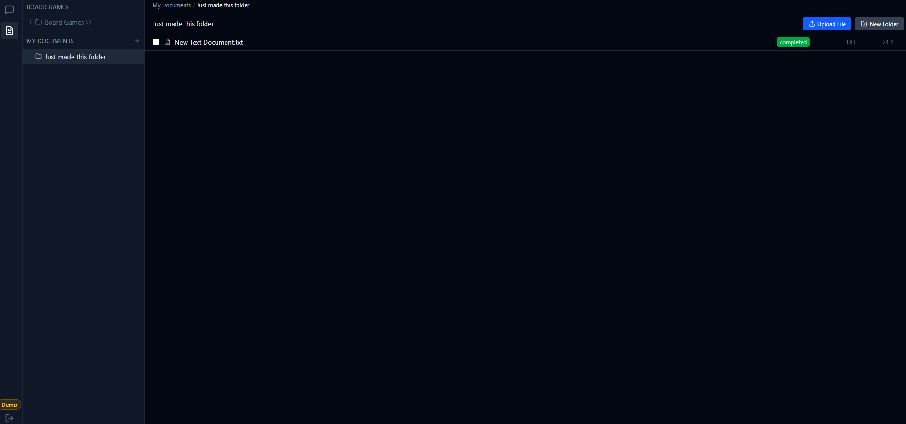
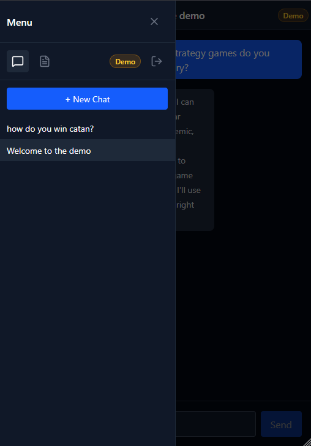

# Board Game Knowledge Base RAG

Agentic RAG over a curated board-game corpus — search rules, compare mechanics, recommend games. Built in public as a portfolio piece.

## Live demo

**[boardgame-rag-prod.pages.dev](https://boardgame-rag-prod.pages.dev)**

**Try the demo — no signup required.** Click "Try the demo" on the login page. Anonymous Supabase session, 7-day cleanup, isolated by RLS.

Bundled with the public board-game KB and a D&D 5e quick-reference cheat sheet so you can ask about Catan rules and an advantage roll in the same conversation.

<!-- badges sourced from 08-07-SUMMARY.md -->




## What it does

- **Chat over a curated board-game knowledge base** — a pre-seeded library of popular games (Catan, Ticket to Ride, Pandemic, and more) plus your own private uploads, all queryable in one conversation.
- **Anonymous demo onboarding** — one click mints an anon session seeded with a welcome thread and a D&D 5e quick-reference document, so the agent has something to reason over immediately.
- **Agentic tool loop** — the LLM decides which tool to use per turn: hierarchical KB navigation, hybrid retrieval, text-to-SQL over structured data, web-search fallback, and a context-isolated document-analysis subagent.
- **Hybrid search** — keyword + vector retrieval fused with Reciprocal Rank Fusion, then reranked, so answers cite the right chunk.
- **Transparent tool calls** — every search, read, and SQL query the agent runs is shown inline as an expandable card.
- **Mobile-first UX** — responsive chat with a swipe-to-close drawer; streamed SSE responses; graceful in-thread error bubbles with one-tap retry.

## Tech stack

### Code stack

| Tech | Role |
|------|------|
| React 19 | Frontend UI framework — chat, documents, auth pages |
| TypeScript 5.9 | Typed frontend — components, hooks, API client |
| Tailwind CSS 4 | Utility-first styling |
| Vite 6 | Frontend build tool and dev server |
| FastAPI 0.115 | Backend HTTP + SSE API framework |
| Python 3.11 | Backend services — LLM, retrieval, ingestion, parsing |
| pgvector | Vector similarity search inside Postgres |
| Docling | PDF / DOCX / HTML / Markdown extraction to searchable text |
| OpenAI SDK 1.74 | LLM chat completions and embeddings (OpenAI-compatible) |

### Services & infrastructure

| Service | Link | What it does | How this project uses it |
|---------|------|--------------|--------------------------|
| Cloudflare Pages | [pages.cloudflare.com](https://pages.cloudflare.com) | Static site hosting + CDN | Serves the React SPA bundle; push-to-deploy from the default branch. |
| Fly.io | [fly.io](https://fly.io) | Container hosting | Runs the FastAPI + Docling backend container in `iad` on shared-cpu-1x. |
| Supabase | [supabase.com](https://supabase.com) | Postgres, Auth, Storage, Realtime | Stores threads, messages, documents, and chunk embeddings; issues JWTs incl. anonymous sign-ins; holds uploaded files; pushes ingestion status. |
| OpenRouter | [openrouter.ai](https://openrouter.ai) | LLM API gateway | Backs all chat completions via the OpenAI-compatible SDK. |
| Sentry | [sentry.io](https://sentry.io) | Error monitoring | Captures uncaught and explicitly-reported frontend errors. |
| LangSmith | [smith.langchain.com](https://smith.langchain.com) | LLM tracing | Captures backend traces of the agentic tool loop for inspection. |
| UptimeRobot | [uptimerobot.com](https://uptimerobot.com) | Uptime monitoring | Probes `/api/health` every 5 minutes; feeds the uptime badge above. |
| GitHub | [github.com](https://github.com) | Source hosting + CI trigger | Hosts the repo; pushes to the default branch trigger the Cloudflare Pages build. |
| Docling | [github.com/docling-project/docling](https://github.com/docling-project/docling) | Document parsing | Converts uploaded PDF / DOCX / HTML / Markdown into searchable text inline on upload. |

## Architecture



The React SPA is served as a static bundle from the Cloudflare Pages CDN and talks to the FastAPI backend on Fly.io over HTTPS + SSE. The backend is stateless — every chat request reloads thread history from Supabase and streams completions back token by token. Row-Level Security scopes every query to the calling user, so the shared default KB is visible to all while private uploads stay isolated. Each chat turn runs an agentic tool loop: the LLM picks a tool, the backend executes it against Supabase or an external API, and the result feeds back until the model produces a final answer. Observability fans out independently — frontend errors to Sentry, backend traces to LangSmith, uptime probes from UptimeRobot.

## Screenshots









## Deploy

### 1. Backend container

Build the backend image from the repo root and smoke-test it locally:

```
docker build -t boardgame-rag-backend .
```

The single-stage Dockerfile bundles CPU-only torch, Docling models, and the sample seed doc. See `.planning/phases/02-dockerize-backend/02-SUMMARY.md` for the full build + smoke-test recipe.

### 2. Backend to Fly

Deploy the container to Fly.io:

```
flyctl deploy -a boardgame-rag-prod
```

Secrets (Supabase keys, LLM key, observability DSNs) are managed as Fly secrets — see `.planning/phases/04-deploy-backend-to-fly-io/04-SUMMARY.md` for the full secrets contract.

### 3. Frontend to Cloudflare Pages

The frontend deploys on push — Cloudflare Pages is connected to the repo's default branch and auto-builds. SPA routing and the `_redirects` rule are documented in `.planning/phases/05-deploy-frontend-to-cloudflare-pages/05-SUMMARY.md`.

## Built as

Capstone for the AI Automators Claude Code Masterclass — the full course README is preserved at [docs/MASTERCLASS.md](docs/MASTERCLASS.md). Third-party content and license attribution is listed in [docs/CREDITS.md](docs/CREDITS.md).
